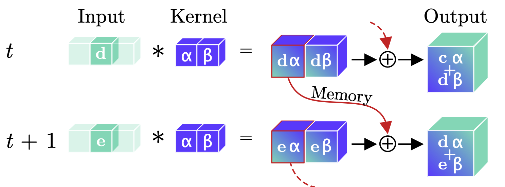

# Continual Inference
Building blocks for Continual Inference Networks in PyTorch

[](https://codecov.io/gh/LukasHedegaard/continual-inference)
[](https://opensource.org/licenses/Apache-2.0)
[](https://github.com/psf/black)

```bash
pip install continual-inference
```

## Continual Inference Networks (CINs)
Continual Inference Networks are a type of neural network, which operate on a continual input stream of data and infer a new prediction for each new time-step.

All networks and network-modules, that do not utilise temporal information can be used for an Online Inference Network (e.g. `Conv1d` and `Conv2d` on spatial data such as an image). 
Moreover, recurrent modules (e.g. `LSTM` and `GRU`), that summarize past events in an internal state are also useable in CINs.

__A CIN__:
```
  O       O       O      (output)
  ↑       ↑       ↑       
LSTM    LSTM    LSTM     (temporal LSTM)
  ↑       ↑       ↑    
Conv2D  Conv2D  Conv2D   (spatial 2D conv)
  ↑       ↑       ↑    
  I       I       I      (input frame)
```

However, modules that operate on temporal data with the assumption that the more temporal context is available than the current frame (e.g. the spatio-temporal `Conv3d` used by many SotA video recognition models) cannot be directly applied.

__Not a CIN__:
```
          Θ              (output)   
          ↑              
        Conv3D           (spatio-temporal 3D conv)
          ↑
  -----------------      (concatenate frames to clip)
  ↑       ↑       ↑    
  I       I       I      (input frame)  
```

Sometimes, though, the computations in such modules, can be cleverly restructured to work for online inference as well! 

__A CIN__:
```
   O         O         Θ      (output)
   ↑         ↑         ↑    
ConvCo3D  ConvCo3D  ConvCo3D  (continual spatio-temporal 3D conv)
   ↑         ↑         ↑    
   I         I         I      (input frame)
```
Here, the `ϴ` output of the `Conv3D` and `ConvCo3D` are identical! ✨

## Modules
This repository contains online inference-friendly versions of common network building blocks, inlcuding:

<!-- TODO: Replace with link to docs once they are set up -->
- (Temporal) convolutions:
    - [x] `ConvCo1d`
    - [x] `ConvCo2d`
    - [x] `ConvCo3d`

- (Temporal) batch normalisation:
    - [x] `BatchNormCo2d`

- (Temporal) pooling:
    - [x] `AvgPoolCo1d`
    - [x] `AvgPoolCo2d`
    - [ ] `AvgPoolCo3d`
    - [ ] `MaxPoolCo1d`
    - [x] `MaxPoolCo2d`
    - [ ] `MaxPoolCo3d`
    - [ ] `AdaptiveAvgPoolCo1d`
    - [x] `AdaptiveAvgPoolCo2d`
    - [ ] `AdaptiveAvgPoolCo3d`
    - [ ] `AdaptiveMaxPoolCo1d`
    - [x] `AdaptiveMaxPoolCo2d`
    - [ ] `AdaptiveMaxPoolCo3d`

- Other
    - [x] `Delay` - pure delay module
    - [x] `Continual` - functional wrapper for non-continual modules

### Continual Convolutions
Continual Convolutions can lead to major improvements in computational efficiency when online / frame-by-frame predictions are required.

Below, principle sketches comparing regular and continual convolutions are shown:

<div align="center">

  <br>
  Regular Convolution. 
	A regular temporal convolutional layer leads to redundant computations during online processing of video clips, as illustrated by the repeated convolution of inputs (green b,c,d) with a kernel (blue α,β) in the temporal dimen- sion. Moreover, prior inputs (b,c,d) must be stored be- tween time-steps for online processing tasks.
  <br><br>  
  
  <br>
  Continual Convolution. 
	An input (green d or e) is convolved with a kernel (blue α, β). The intermediary feature-maps corresponding to all but the last temporal position are stored, while the last feature map and prior memory are summed to produce the resulting output. For a continual stream of inputs, Continual Convolutions produce identical outputs to regular convolutions.
  <br><br>
</div>


For more information, we refer to the [seminal paper on Continual Convolutions](https://arxiv.org/abs/2106.00050).

## Forward modes
The library components feature three distinct forward modes, which are handy for different situations.

### `forward`
Performs a forward computation for a single frame and continual states are updated accordingly. This is the mode to use for continual inference.

```
O+S O+S O+S O+S   (O: output, S: updated internal state)
 ↑   ↑   ↑   ↑ 
 N   N   N   N    (N: nework module)
 ↑   ↑   ↑   ↑ 
 I   I   I   I    (I: input frame)
```

### `forward_regular`
Performs a layer-wise forward computation using the continual module.
The computation is performed frame-by-frame and continual states are updated accordingly.
The output-input mapping the exact same as that of a regular module.
This mode is handy for initialising the network on a whole clip (multipleframes) before the `forward` is usead for continual inference. 
```
         O            (O: output)
         ↑ 
 -----------------    (-: aggregation)
 O  O+S O+S O+S  O    (O: output, S: updated internal state)
 ↑   ↑   ↑   ↑   ↑
 N   N   N   N   N    (N: nework module)
 ↑   ↑   ↑   ↑   ↑
 P   I   I   I   P    (I: input frame, P: padding)
```

### `forward_regular_unrolled`
Performs a full forward computation exactly as the regular layer would.
This method is handy for effient training on clip-based data.

```
         O            (O: output)
         ↑ 
         N            (N: nework module)
         ↑ 
 -----------------    (-: aggregation)
 P   I   I   I   P    (I: input frame, P: padding)
```

## Compatibility
The library modules are built to integrate seamlessly with other PyTorch projects.
Specifically, extra care was taken to ensure out-of-the-box compatibility with:
- [pytorch-lightning](https://github.com/PyTorchLightning/pytorch-lightning)
- [ptflops](https://github.com/sovrasov/flops-counter.pytorch)
- [ride](https://github.com/LukasHedegaard/ride)


## Projects
For full-fledged examples of complex Continual Inference Networks, see:

- [Continual 3D](https://github.com/LukasHedegaard/co3d) [](https://arxiv.org/abs/2106.00050)
- [Continual Skeletons](https://github.com/LukasHedegaard/continual-skeletons)


## Citations
This library
```bibtex
@article{hedegaard2021colib,
  title={Continual Inference Library},
  author={Lukas Hedegaard},
  journal={TBD},
  year={2021}
}
```

[Continual 3D CNNs](https://github.com/LukasHedegaard/co3d) [](https://arxiv.org/abs/2106.00050)
```bibtex
@article{hedegaard2021co3d,
  title={Continual 3D Convolutional Neural Networks for Real-time Processing of Videos},
  author={Lukas Hedegaard and Alexandros Iosifidis},
  journal={TBD},
  year={2021}
}
```

[Continual Skeletons](https://github.com/LukasHedegaard/continual-skeletons)
```bibtex
@article{hedegaard2021coskelleton,
  title={Continual Skeletons for Efficient Online Activity Recognition},
  author={Lukas Hedegaard and Negar Heidari and Alexandros Iosifidis},
  journal={TBD},
  year={2021}
}
```